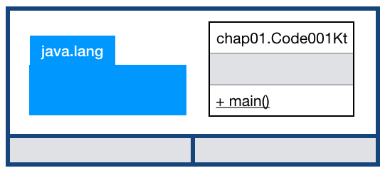

== 최상위 함수와 T-Memory

=== main 메서드는 최상위 함수로 선언한다.

.Code001.kt
[source,kotlin]
----
package chap01

fun main(args: Array<String>) {
    println("Hello, World!!!")
}
----

.자바로 변환된 코틀린 코드
[soruce,java]
----
package chap01;

import kotlin.Metadata;
import kotlin.jvm.internal.Intrinsics;
import org.jetbrains.annotations.NotNull;

@Metadata(
   mv = {1, 1, 13},
   bv = {1, 0, 3},
   k = 2,
   d1 = {"\u0000\u0014\n\u0000\n\u0002\u0010\u0002\n\u0000\n\u0002\u0010\u0011\n\u0002\u0010\u000e\n\u0002\b\u0002\u001a\u0019\u0010\u0000\u001a\u00020\u00012\f\u0010\u0002\u001a\b\u0012\u0004\u0012\u00020\u00040\u0003¢\u0006\u0002\u0010\u0005¨\u0006\u0006"},
   d2 = {"main", "", "args", "", "", "([Ljava/lang/String;)V", "tmemory"}
)
public final class Code001Kt {
   public static final void main(@NotNull String[] args) {
      Intrinsics.checkParameterIsNotNull(args, "args");
      String var1 = "Hello, World!!!";
      System.out.println(var1);
   }
}
----

=== kt 파일은 Java Class 로 변환된다.

#Kotlin 파일은 "Pascal Case 변경된 파일명" + "Kt" 라는 Java Class 로 변경된다.#

위에서 코드에서 살펴 보면 Code001.kt 파일이 Code001Kt 라는 Java Class 로 변환되어진 것을 확인할 수 있다.  이 때 .(콤마)는 class 명에서 사라지고 확장자인 kt 가 Pascal Case 로 변경되어 Class 명으로 변환되어 진 것을 알 수 있다.

.Kotlin 파일 to Java Class 예
|==========================
|kotlin 파일|변환된 Java Class
|a.kt|public final class AKt
|myName.kt|public final class MyNameKt
|Your.kt|public final class YourKt
|==========================

=== T-Memory 분석

최상위 함수는 해당 패키지, 클래스의 public static final 메서드가 된다.