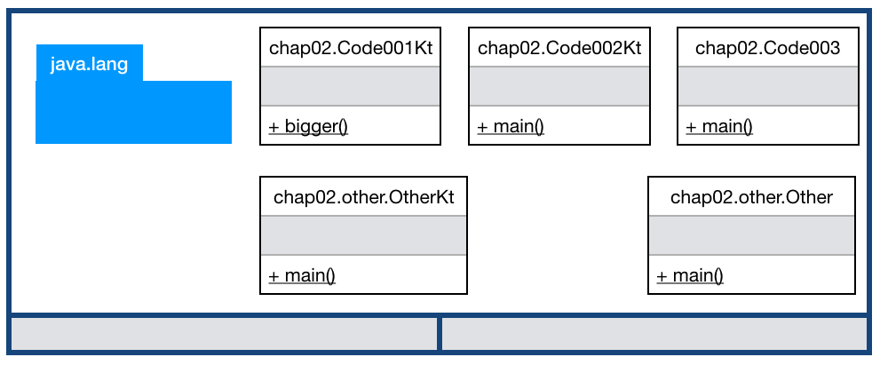
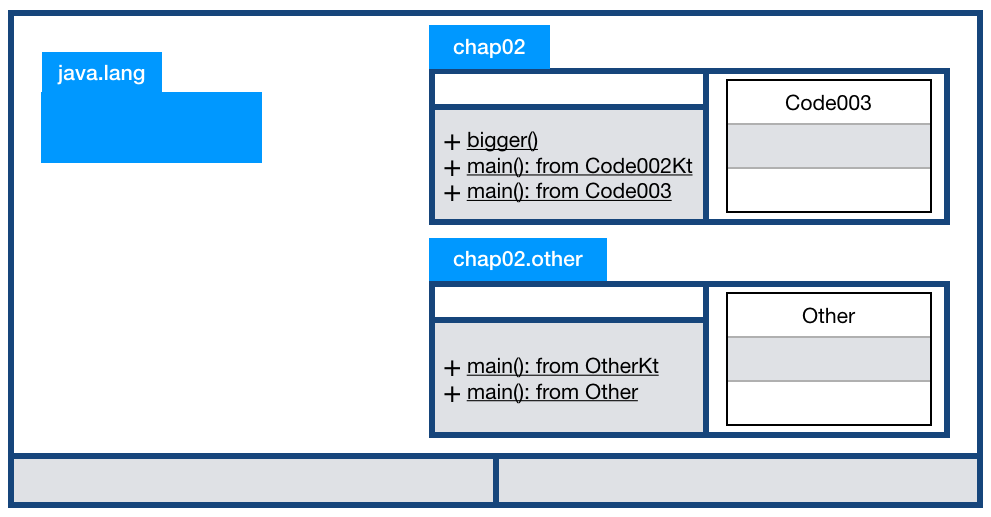

== 함수

=== 최상위 함수 호출: 같은 패키지 내에서

.Code001.kt
[source,kotlin]
----
package chap02

fun bigger(a: Int, b: Int) : Int {
    return if (a > b) a else b
}
----

.Code002.kt
[source,kotlin]
----
package chap02

fun main(args: Array<String>) {
    println(chap02.bigger(5, 7))
    println(bigger(9, 7))
}
----

두 개의 kt 파일을 만들었다. bigger 최상위 함수를 호출하는 2가지 방식이 표현되어 있다.

* 패키지명.최상위함수명
   - 신기방기: 코틀린 런타임이 찾아줘요.
* 최상위함수명
   - 신기방기: 코틀린 런타임이 찾아줘요.
   - 같은 패키지 내에서만 가능 / 다른 kt 파일에 있어도 package 가 같으면 되요.

만약 Java 파일에서 접근하고자 한다면 다른 방식을 사용해야 한다.

* 패키지명.#변환된클래스명#.최상위함수명
* #변환된클래스명#.최상위함수명
   - 같은 패키지 내에서만 가능

.Code003.java
[source,java]
----
package chap02;

public class Code003 {
    public static void main(String[] args) {
        System.out.println(chap02.Code001Kt.bigger(5, 7));
        System.out.println(Code001Kt.bigger(9, 7)); // 같은 패키지라면 패키지명 생략
        // System.out.println(bigger(5, 7)); // 불가 - Cannot resolve method 'bigger(int, int)'
    }
}
----

최상위 함수가 패키지 차원에서 식별되기 때문에, 같은 함수 시그니처의 최상위 함수를 같은 패키지 내의 다른 kt 파일일찌라도 중복 정의할 수 없다. 
단, main 함수 제외...
중복 정의된 main 함수는 다른 kotlin 파일에서 호출할 수 없다.
main 용도 자체가 다른 곳에서 호출되는 용도가 아니니까 예정 인정? 응! 인정!!!

=== 최상위 함수 호출: 다른 패키지 내에서 

.Other.kt
[source,kotlin]
----
package chap02.other

fun main(args: Array<String>) {
    println(chap02.bigger(9, 11));
}
----

위는 예상대로이다. 
그런데 매번 package 명을 입력하기 귀찮... 
그렇다면 import static...
하지만 예상과 다르게 kt 파일에서는 그냥 import

.Other.kt
[source,kotlin]
----
package chap02.other

//fun main(args: Array<String>) {
//    println(chap02.bigger(9, 11));
//}

import chap02.bigger

fun main(args: Array<String>) {
    println(bigger(9, 11));
}
----

kotlin 에는 별도의 import static 구분이 없다.

자바에는 그대로 import static 을 쓰면 되겠다.

.Other.java
[source,java]
----
package chap02.other;

import static chap02.Code001Kt.bigger;

public class Other {
    public static void main(String[] args) {
        System.out.println(bigger(5, 7));
    }
}
----

=== T-Memory 보고 가실계요.

.Java 개발자 입장

link:http://www.yes24.com/24/Goods/17350624?Acode=101[스프링 입문을 위한 자바 객체 지향의 원리와 이해]에서 익숙하게 사용했던 그림이다.

.Kotlin 개발자 입장

Kotlin 개발자 입장에서는 T-Memory 에서 Package 를 다른 방식으로 그리는 것을 추천한다.

|================
|패키지명|
|최상위 변수들 .2+|클래스들
|최상위 함수들
|================

Java 파일과 Kotlin 파일을 혼합해서 작성하다보면 신경 쓸 부분이 많아진다.
따라서 여기서는 Kotlin 개발자는 Kotlin 파일만 작성하는 걸로 합의해 주세요. 제발요. Please

=== 함수의 인자는 불변이다.

.Code004.kt
[source,kotlin]
----
package chap02

fun smaller(a : Int, b: Int) : Int {
    // a = 100 // Val cannot be reassigned.

    return if (a > b) b else a
}
----

주석을 제거하면 바로 #"Val cannot be reassigned."# 이라며 컴파일타임 에러를 표시한다.
이로써 함수의 인자는 불변임을 알 수 있다.